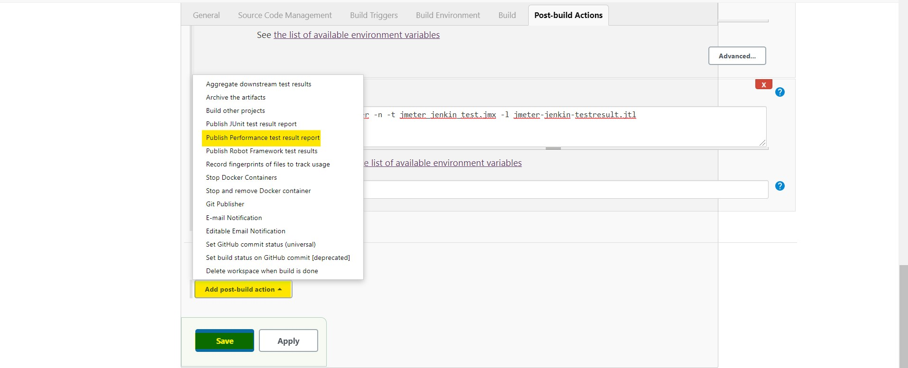
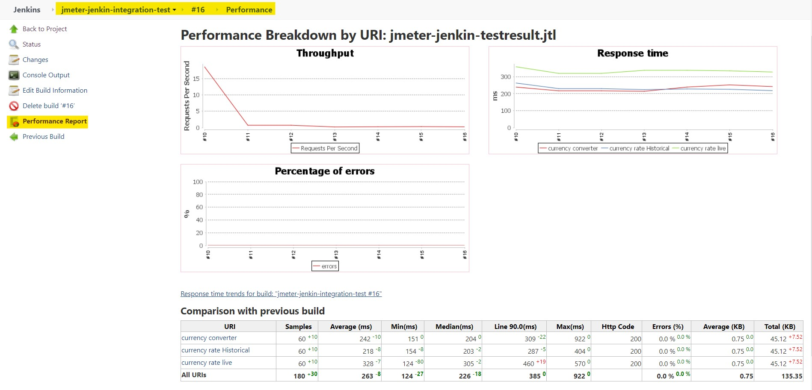

# Jmeter-Jenkin-Integration-Test
Jmeter-Jenkin-Integration-Test is a sample project to show how the jmeter test are integrated in Jenkins CI pipeline. 
It provides step by step to run in jenkins and also shows how to generate performance reports.

# Contents
### [1. Introduction to Jmeter](#intro)
### [2. Jmeter Feature](#feature)
### [3. Prerequisites](#prerequisites)
### [4. Steps to integrate jmeter project to Jenkins CI](#jemter-jenkin-steps)
### [What is Throughput? in Jenkins](#throughput)

### 1. Introduction to jmeter <a name="intro"></a>
JMeter is an open source testing software. It is 100% pure java application for load and performance testing. JMeter is designed to analyse and measure the performance and load functional behaviour of web application and variety of services.

JMeter is mainly used for testing Web application or FTP application but currently, it is applicable in functional testing, JDBC database connections, Web services, generic TCP connections and OS native processes. jMeter is designed to cover categories of tests like load, functional, performance, regression, etc., and it requires JDK 5 or higher.

### 2. Jmeter Feature <a name="feature"></a>
Following are some important features of JMeter:

* **Open source application:** JMeter is an open source software. Therefore, it is freely available.
* **User-friendly GUI:** It has a simple and interactive GUI.
* **Support various server types:** JMeter can conduct load and performance test for many different server types – Web – HTTP, HTTPS, SOAP, Database via JDBC, LDAP, JMS, Mail – POP3, etc.
* **Platform independent:** It is a platform independent tool as it is written and developed using Java.
* **Framework:** It is a multi-threading framework which allows concurrent sampling by many threads and simultaneous sampling of different functions by separate thread groups.
* It is **highly extensible**.

### 3. Prerequisites <a name="prerequisites"></a>
* You should have Jmeter installed on your PC. You can install using the following link. [Jmeter installation steps](https://www.guru99.com/guide-to-install-jmeter.html)
* You should have Jenkins installed on your PC. for installation follow this steps. [Jenkins installation steps](https://dzone.com/articles/how-to-install-jenkins-on-windows)

### 4. Steps to integrate Jmeter project to Jenkins CI <a name="jemter-jenkin-steps"></a>

1. Clone the project in your PC using git clone cmd. Or download the Zip file.
    ```
    git clone https://github.com/Anilkumar-Shrestha/Jmeter-Jenkin-Integration-Test.git
    ```
2. Configure and add Performance plugins in Jenkins
    * Go to "Manage Jenkins" in left bar and click on "plugin Manager". You will see the horizontal bar, click on Available and type "performance" on search bar. Install the plugin without restart.
    
3. Create a freestyle project and configure it.
    * click on New item.
    
    * Give a suitable project name and select the free style project and click on OK button as shown.
    
    * Go to Build and click on Add build steps. It pop up the list where you should click on "Execute Window batch Command".
    
    * Add below command lines. (You can check [this doc](https://jmeter.apache.org/usermanual/get-started.html#running) for command line parameters)
        ```
        C:\apache-jmeter-5.3\bin\jmeter -Jjmeter.save.saveservice.output_format=xml -n -t C:\apache-jmeter-5.3\Jmeter-jenkin-integration-test\Jmeter-Jenkin-Integration-Test\jmeter_jenkin_test.jmx -l jmeter-jenkin-testresult.jtl
        ```
    
    * Go to Post-build Actions and click on Add Post-build steps. Select "Publish Performance test result report".
    
    * Add source data files as the above command -L parameter filename. Incase of current keep "jmeter-jenkin-testresult.jtl".
    
    * click on Save button.
4. Click on Build Now. You should build twice or more to see the graphical performance report.
5. Go to build number and check the Performance Report. You will see the report as follows.
    
6. Also you will see the Performance trend in the project dashboard.
    

    
    
### What is Throughput? in Jenkins <a name="throughput"></a>
The Throughput is the most important parameter in stress testing. It signifies number of transactions or requests that can be made in a given period of time. It is a useful measurement to check the load capacity of the server. It represents the ability of the server to handle a heavy load.  The higher the Throughput is, the better is the server performance.

